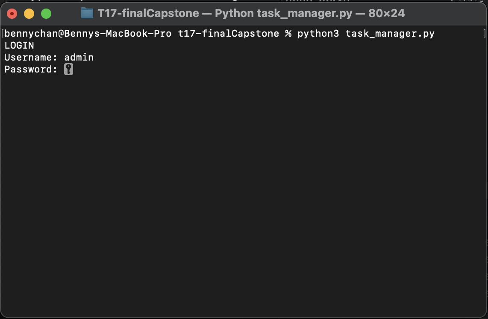

# Task Manager

Task Manager is a Python program that helps users manage tasks by providing functionalities to add, view, and modify tasks. It also generates reports to provide insights into task completion and user activities.

## Table of Contents

- [Installation](#installation)
- [Usage](#usage)
- [Credits](#credits)

## Installation

To run this project locally, follow these steps:

1. Clone the repository to your local machine.
2. Ensure you have Python installed on your system.
3. Ensure you have packages "tabulate", "pandas" and "numpy" installed.
4. Open the project folder in your preferred code editor.
5. Run the program using the command `python task_manager.py`.

## Usage

After installing the project, follow these instructions to use it:

1. Upon running the program, you will be prompted to log in with your username and password. Use the default username `admin` and password `password`.
2. Once logged in, you will see a menu with options to register a new user, add a task, view all tasks, view your tasks, generate reports, and exit the program.
3. Choose an option by entering the corresponding letter.
4. Follow the prompts to complete the selected action.

Screenshots:


*Login Screen*


*Main Menu*

## Credits

This project was created by [Your Name]. If you have any questions or feedback, feel free to contact me at [your@email.com].

## Codes of the Project

```python
# Paste your project codes here
